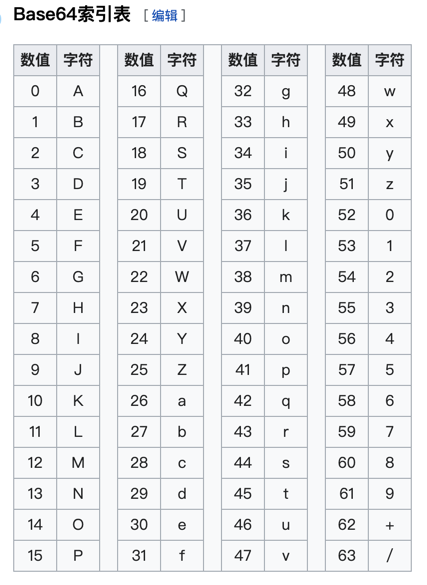
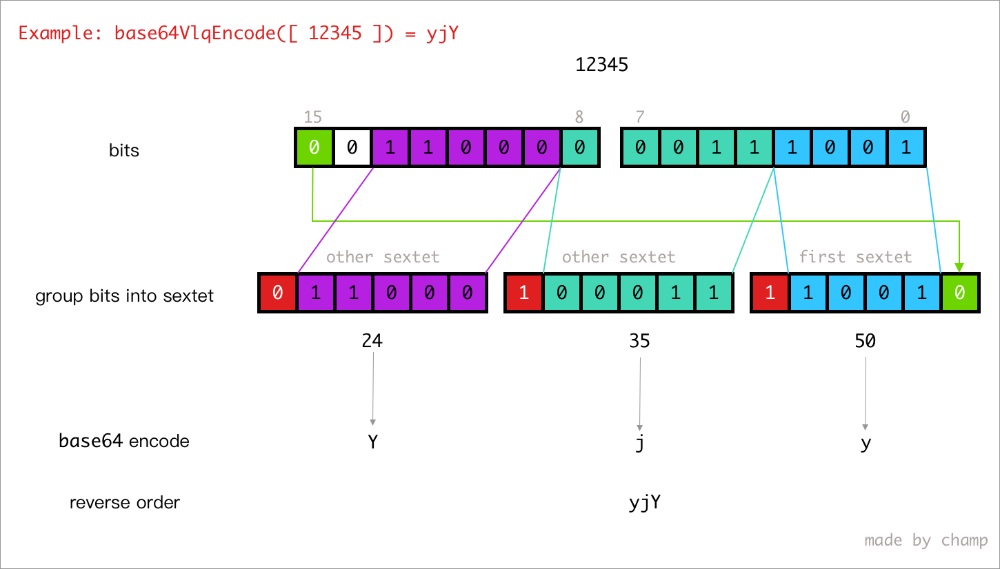

# mozilla/source-map

## base64 编码表

## base64-vlq 编码原理

## 关于 Source map 规范
通过阅读源码，更加深入了解了Source Map的规范，Source Map分为2种，即源码中的`BasicSourceMapConsumer`和`IndexedSourceMapConsumer`，后者支持合并多个Source Map，通过`sections`字段将多份Souce Map连接起来。

> 为了避免遭受 [XSSI](https://security.googleblog.com/2011/05/website-security-for-webmasters.html) 攻击，Source Map文件的第一行可以是以`)]}'`开头的任意内容，在解析Source Map时需要忽略这样的行。
