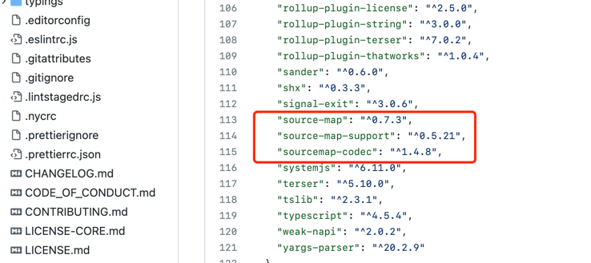
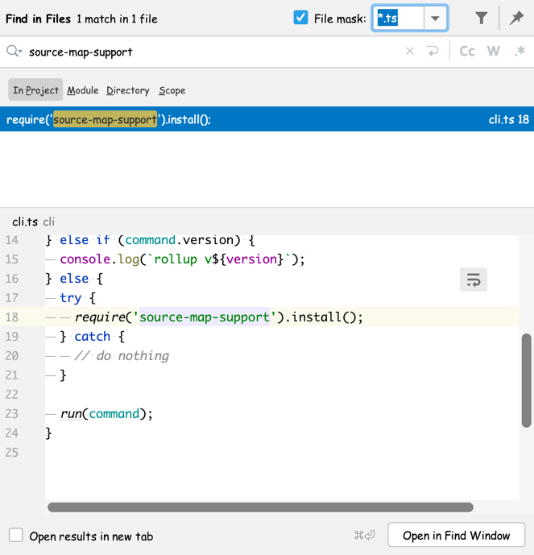
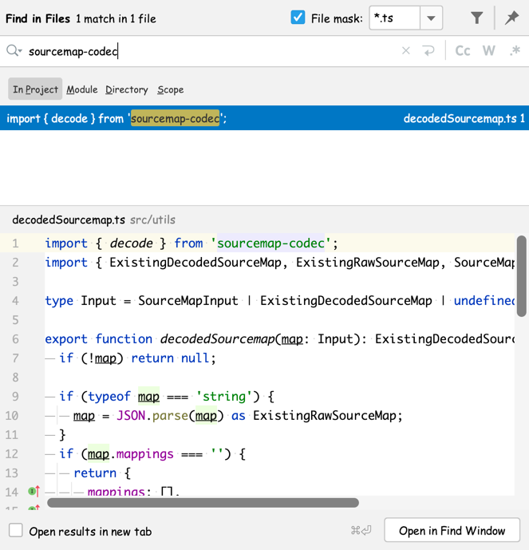
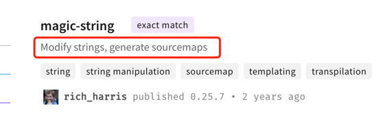
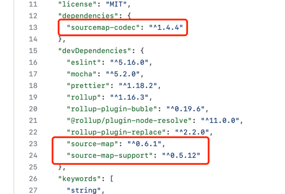

# rollup 内部的 SourceMap

这篇文章我想研究下`rollup`内部是如何使用 SourceMap 的，学习一下这些牛逼的开源项目的技术。

首先看依赖，看它依赖了哪些 SourceMap 相关的库：

可以看到，`package.json`文件中 SourceMap 相关的依赖只有这3个：

- source-map
- source-map-support
- sourcemap-codec

## 1. source-map
这个库就不用多说了，应该是属于行业标准，是由 Mozilla 开源在 [github][mozilla/source-map] 上，用于生成和使用 SourceMap 的一个基础库。

[mozilla/source-map]: https://github.com/mozilla/source-map

## 2. source-map-support
这个库是让 node 也支持 SourceMap。

我们知道 JavaScript 的两大运行环境分别是浏览器和 Node，而浏览器对 SourceMap 的支持由浏览器厂商在 DevTools 中实现的，而 Node 官方好像没有自己去实现对 SourceMap 的支持。而这个库就是干这个事儿的，通过 [V8 stack trace API][V8StackTraceAPI] 实现了对 SourceMap 的支持。

> 内部也是使用上面 Mozilla 的 source-map 库去处理 SourceMap 的。

[V8StackTraceAPI]: https://v8.dev/docs/stack-trace-api

## 3. sourcemap-codec
这个库是 Rich Harris 本人(也是rollup作者)实现的用于处理 SourceMap 中`mappings`字段的编解码的工具。

> `mappings`字段采用的是 base64-vlq 编码，这种编码的具体过程，可以查看我的另一篇分析文章：[base64-vlq编码原理][base64-vlq编码原理]

[base64-vlq编码原理]: ../../mozilla/source-map/README.md#base64-vlq-编码原理

---

这3个依赖项目介绍完了，接下来，我们就看一下在 rollup 这个项目中，具体是如何使用它们的。

直接在项目中全局搜索 `source-map` 的引入，没有搜到任何信息，好像是这个项目没有直接引用`source-map`这个库。

而搜索`source-map-support`的引用，只在`cli/cli.ts`文件中发现有引用：

可以看到，在执行 rollup 相关命令之前，安装了`source-map-support`这个库，也就是为 Node 进程提供 SourceMap 支持。至于这个库是如何使用 V8 的相关API实现这个功能，我后面会单独进行分析。

接着，再搜索一下`sourcemap-codec`这个库的引用：

可以看到，这个库也只在`src/utils/decodedSourcemap.ts`文件中有引用，而这个文件唯一导出的就是一个`decodedSourcemap`函数。这个函数也很简单，就是将`map`中的`mappings`字段解码。

---

到目前为止，我并没有发现我想要的东西——rollup是如何处理 SourceMap 的，也就是说，rollup在打包一个项目的时候，是如何生成最终的sourcemap文件的。

继续搜索`soucemap`关键字，发现项目中有引用一个`magic-string`可能跟SourceMap的生成有关。
在npm仓库搜索时发现：

由此可知，rollup 对 SourceMap 的处理都封装在了`magic-string`这个包里面了。

那么接下来，我们就来看一下`magic-string`是如何处理 SourceMap 的。

还是先看`package.json`：

还是上面那几个依赖。
不过值得注意的是，只有`sourcemap-codec`是运行时依赖，其他两个都是开发依赖。通过查看代码得知，SourceMap 的生成并没有借助`source-map`这个库，而是`magic-string`内部生成的，引入这个库只是为了验证生成的 SourceMap 是正确的。

至于`magic-string`内部是如何生成 SourceMap 的，可以查看`MagicString#generateDecodedMap`这个函数的实现。
