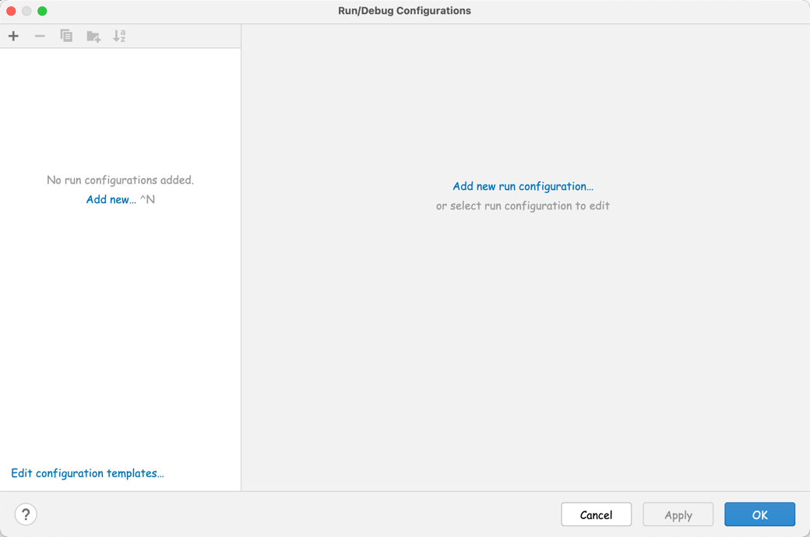
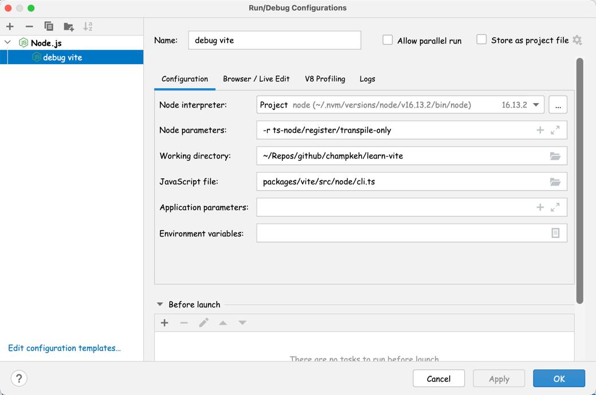
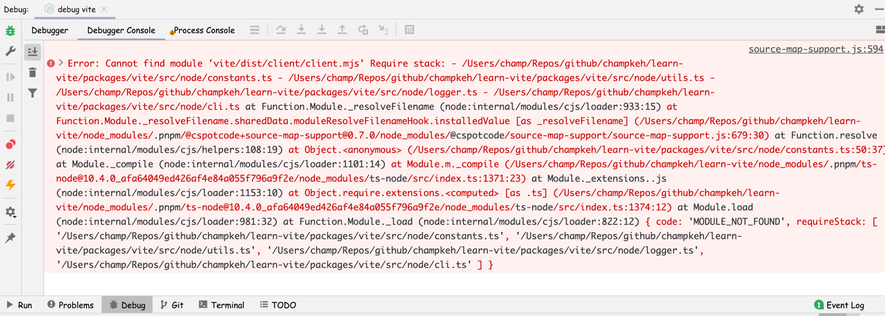
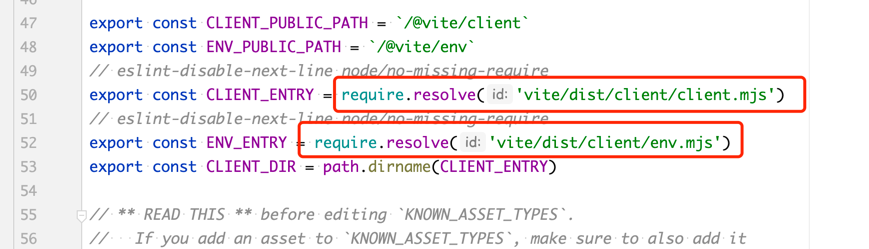

# 手把手教你调试 vite 源码

> 在学习开源项目的时候，如果能使用调试器一步一步地分析代码的执行流程，那将会对分析过程有非常大的帮助。

由于 vite 项目是采用 typescript 编写的，所以想要调戏它，就需要有一个能够直接执行 ts 的运行环境。正好社区有一个 [ts-node](https://typestrong.org/ts-node/)
项目可以让我们用`node`直接执行 ts 代码。

关于这个项目的更多介绍可以查看[官网](https://typestrong.org/ts-node/), 这里我们直接介绍如何配置编辑器来调试 vite 源码。

## 安装依赖

由于我们需要用到`ts-node`，所以需要先安装它。所幸的是，vite 项目的开发依赖里面已经有`ts-node`这个依赖了，所以我们就不需要自己装了，把 vite 项目 clone 下来之后把依赖安装一下就可以了。

> 如果后续 vite 没有了这个依赖，我们可以执行下面的命令手动安装：
>
> ```shell
> npm install -D ts-node
> ```

## webstorm 设置

通过菜单 "Run > Edit Configuration..." 打开 "Run/Debug Configurations" 对话框：



添加一个 Node.js 配置，如下：



需要注意的是，Node parameters 参数配置为`-r ts-node/register/transpile-only`，表示我们要给 node 预加载一个包，这个包的效果就是给 node 原生的`require`
函数注入代码，以达到对引入的 ts 代码实现 JIT 编译。具体原理可以看[官方介绍](https://typestrong.org/ts-node/docs/how-it-works) 。

然后就是 JavaScript file 配置，这里我只想调试 vite 命令行，所以我配置成`packages/vite/src/node/cli.ts`，也就是 vite 命令行文件的路径。

大功告成，点击调试按钮开始调试吧！

如果你不幸遇到了下面这个错误：



是因为 vite 源码中有引用了构建之后的文件，而我们还没有对项目进行一个构建，所以对应的文件还不存在，启动不起来。

我们也可以切换到 Process Console 面板看一下进程输出的错误信息：


可以看到，`constants.ts`文件中有引用`vite/dist/client/client.mjs`文件，但是却找不到该文件。 翻看一下`constants.ts`源码，也可以发现该文件有下面这两个引用：



既然知道了原因，那我们就先将项目`build`一下，执行以下命令：

```shell
pnpm run build
```

完了之后再进行调试就可以了。放一张调试界面截图：


## vscode 设置

由于对 vscode 不熟，没有配置成功 😢

## 参考

- [ts-node](https://typestrong.org/ts-node/)
